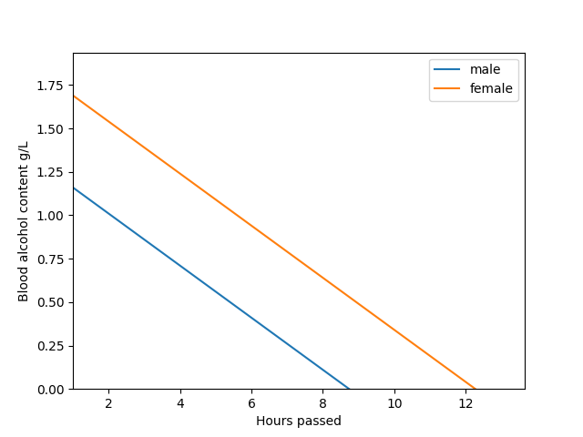
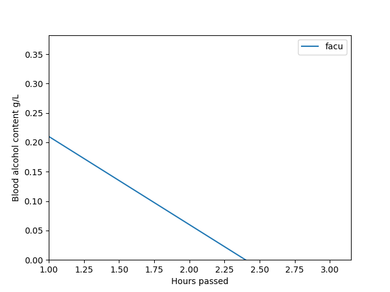

# Blood alcohol content calculator - BAC Calculator

A Python CLI app with GUI graphics generated by matplotlib.
The objetive is to give the users a tool to calculate the Blood Alcohol Content (BAC).

#### Video Demo:  https://youtu.be/r4iW3KLBWno

## Introduction

Hello my name is Facundo Frau, I am a Civil Engineer from Mendoza, Argentina. I work in water and sewers calculations, I started learning to code with python in late 2019. Then in 2020 started the CS50x course and this is my final project. I am looking forward to start a career in programming in the near future.

## Acknowledgments

To my family and girlfriend who supported me, listened to my ideas for solving the problems set and encouraged me to finish the course.

To Leonardo Galante (https://www.leonardogalante.com/), an Argentinian Front-end developer whose volunteer mentoring helped me to organize the ideas and keep motivated to finish the project.

## Usage
Run `python3 bac_calculator.py`
Select one of the 5 options presented in the below menu:

    ------------------------------------------

    1 -> Calculate for an average person (anonymous)

    2 -> Calculate for a custom person (anonymous)

    3 -> Calculate with registered user data

    4 -> Register user data

    5 -> Exit

    ------------------------------------------
Output for 1) Calculate for an average person (anonymous), for 750mL of wine.

Output for 3) Calculate with registered user data, for 550mL of beer.

## Description:

This project is a blood alcohol content (BAC) calculator, I came up with the idea when a local newspaper published an article with a table that showed the BAC you get when you drink beers or wine only. I thought that would be useful to have a tool that estimates the BAC for several drinks and take in consideration people's height, weight and gender.

When I started to design my first idea was to make a Python with a Tkinter GUI app, but later discarded it because making a python gui is a rather difficult task and it is not the best approach.

In second place I thought after consulting with Leonardo Galante that maybe a web app made with HTML, CSS and vanilla JS could be an option. When i started to design the app I realized that I have learned very little of JS while doing the CS50x and it was difficult to learn from 0. I have been studying Python before doing the course and practicing with algorithms and exercises that gave me a little more security. Because of that at the end I decided to make a command line Python script, which could show graphics for more clarity.

The BAC calculator project started with only the feature to calculate for an average person without storing any information and graphs, the Widmark Formula is used to calculations. Then I added the posibility to calculate entering your personal data (height, weight, gender) and obtain personalized results, and can make several calculations and choose when to exit the program.

Because of the complexity of the GUI in python and my beginner knowledge I kept the program as a command line, but the generated graphics with matplotlib - plotly are shown in a separate window. Continuing with the development I added a small database consisting in a csv file that would store user data (username, height, weight, gender, and a factor for calculations), this will allow the user to register and store the information for easier access. Finally the csv was replaced with a SQLite database which is better and faster for querying than the csv which has to be looped all for checking only one user.

The project consists in 5 main files which be explained next:

 1. `bac_calculator.py`
 2. `helpers.py`
 3. `calculations.py`
 4. `drinks.txt`
 5. `database.db`

#### 1 - bac_calculator.py
 This file contains the main program, it has all the options that the user can make. Consist in a while loop and an input for choosing, once chosen different functions are called for completing the task.

#### 2 - helpers.py
This file has all the complementary functions that supports the main files. Logging in, printing the menu, registering the user in the database, loading the drinks, connecting with SQL, plotting the results and asking for user data.

#### 3 - calculations.py
This file contains functions that take drink type, volume and personal data and apply the Widmark Formula, returning the maximum BAC and a timelapse for plotting the graphic.

#### 4 - drinks.txt
Contains a list of most common drinks: name and alcohol volume in %.

#### 5 - database.db
A SQL database which stores registered users data. It contains one table called `users` with 5 columns: username, height, weight, gender and r factor.

## Features:

 1. Calculate the BAC for an average person, choosing a drink and getting a graph of alcohol vs time.
 2. Calculate for your custom data without registering in the database.
 3. Users can register and will be asked to complete personal fields: height, gender and weight (this data is for the widmark formula) in a SQL database.
 4. Calculate the BAC for an registered person, choosing a drink and getting a graph of alcohol vs time.
 5. Users can select from a list of drinks are stored in a .txt file which contains: drink name and %vol alcohol.
 6. The graphs shows the decreasing alcohol until it reaches 0, assuming a linear decrease.

## References:

https://www.ncbi.nlm.nih.gov/pmc/articles/PMC4361698/pdf/10.1177_0025802414524385.pdf

http://www.yasa.org/upload/uploadedfiles/alcohol.pdf

https://www.mscbs.gob.es/ciudadanos/accidentes/docs/modulo2.pdf

https://elgatoylacaja.com/alcohol

https://docs.python.org/3/library/sqlite3.html

https://matplotlib.org/stable/tutorials/introductory/pyplot.html
